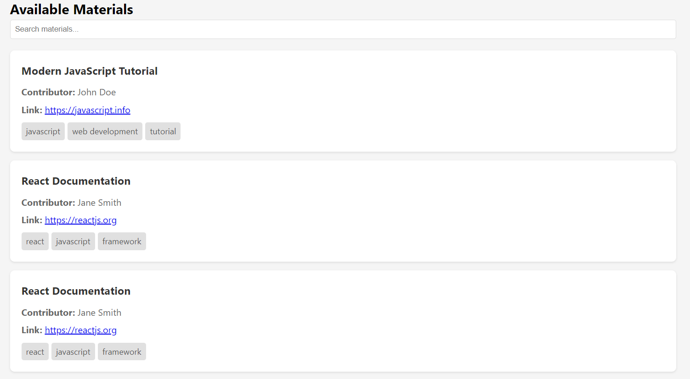

# 🚀 Tech Materials Library

A beautiful single-page application for collecting and sharing valuable tech learning resources! Share your favorite tech materials, tutorials, documentation, and more with the community.


## 🎯 Purpose

The Tech Materials Library serves as a collaborative platform where developers can:
- 📚 Share valuable learning resources
- 🔍 Discover new materials
- 🏷️ Organize content with tags
- 🤝 Contribute to the tech community's knowledge base

## ⚡ Features

- 📱 Responsive design for all devices
- 🔄 Real-time updates when adding new materials
- 🔍 Search functionality
- 🏷️ Tag-based organization
- 💾 Local storage for data persistence
- 🛡️ XSS protection
- ✨ Clean and intuitive UI

## 🛠️ Technologies Used

- HTML5
- CSS3
- JavaScript (ES6+)
- Local Storage API
- Object-Oriented Programming principles

## 🚀 Getting Started

### Prerequisites

- A modern web browser
- Star the repo 🌟
- Visual Studio Code (recommended)
- Live Server extension for VS Code (recommended)

### 🏃‍♂️ Running the Project

1. Clone the repository:
```bash
git clone https://github.com/GDG-On-Campus-ICTU/MaterialHub-Hactoberfest.git
```
Navigate to the project directory:
```bash
cd tech-materials-library
```
Open with VS Code:
```bash
code .
```
Install Live Server extension in VS Code

Click on Extensions icon in VS Code
Search for "Live Server"
Install the extension by Ritwick Dey


Right-click on index.html and select "Open with Live Server"

The application should now be running in your default browser! 🎉
🤝 How to Contribute
We love contributions! Here's how you can help:
1. Fork the Repository 🍴

Click the "Fork" button at the top right of this repository

2. Clone Your Fork 📥
```bash
git clone https://github.com/GDG-On-Campus-ICTU/MaterialHub-Hactoberfest.git
```
3. Create a Branch 🌿
```bash 
git checkout -b your-name
```
4. Make Your Changes ✍️

Add new features    
Fix bugs   
Improve documentation   
Enhance styling   

5. Test Your Changes 🧪

Ensure your changes don't break existing functionality
 
Verify responsive design on various screen sizes

6. Commit Your Changes 💾
```bash
git add .

git commit -m "✨ Add awesome new feature"
```
7. Push to GitHub 🚀
```bash
git push origin your-name
```
8. Create a Pull Request 🎯

Go to your fork on GitHub
Click "New Pull Request"
Select your branch
Submit the pull request with a clear description of your changes

📜 Code Style Guidelines

Use meaningful variable and function names
Add comments for complex logic
Follow consistent indentation
Keep functions small and focused 

🎨 Design Guidelines

Maintain the existing color scheme
Keep UI elements consistent
Ensure responsive design
Follow accessibility best practices

🌟 Featured Contributors
  <a href="https://github.com/GDG-On-Campus-ICTU/MaterialHub-Hactoberfest/graphs/contributors">
  
</a>

 

📄 License
This project is licensed under the MIT License - see the LICENSE file for details.
🙏 Acknowledgments

Thanks to all contributors
Inspired by the amazing tech community
Built with ❤️ for developers by developers


<p align="center">
Made with ❤️ by GDG On Campus ICT-U
</p># MaterialHub-Hactoberfest
